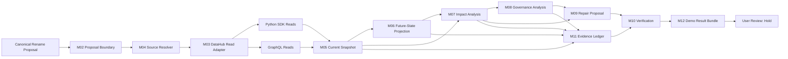

# CHRONOS — Complete Technical Specification

**Verified:** This specification uses only the following source-of-truth documents:

- **Verified:** [Phase 0.1 — DataHub Environment Learning Report](./CHRONOS_DATAHUB_LEARNING_REPORT.md)
- **Verified:** [Phase 0.2 — Showcase Ecommerce Graph Report](./CHRONOS_SHOWCASE_ECOMMERCE_GRAPH_REPORT.md)
- **Verified:** [Phase 0.3 — DataHub Interface Report](./CHRONOS_DATAHUB_INTERFACE_REPORT.md)
- **Verified:** [Phase 0.4 — Canonical Demonstration Specification](./CHRONOS_CANONICAL_DEMONSTRATION_SPECIFICATION.md)

**Inference:** This document freezes implementation-independent behavior, module boundaries, information flow, interface ownership, artifacts, and acceptance conditions; it does not select an application framework or provide code.

## Evidence classification

- **Verified** — established in Phases 0.1–0.4.
- **Inference** — a binding engineering decision derived from those verified findings.
- **Unknown** — evidence not established by the four source documents; a deterministic default is supplied where implementation otherwise would be blocked.

## 1. Executive Summary

**Inference:** CHRONOS is a read-only, single-session, deterministic pre-change metadata impact-review system for one frozen demonstration: **The Revenue Column Rename Impact Review**.

**Verified:** The fixed proposal is to rename PostgreSQL `orders.order_total`, currently typed Number, to `order_amount`.

**Verified:** The current showcase graph contains 25 downstream field descendants across 20 datasets for `order_total`, with a maximum field depth of 5 across PostgreSQL, Spark, S3, Snowflake, dbt, Looker, Power BI, Tableau, and order history; the affected dataset graph reaches chart and dashboard context.

**Inference:** CHRONOS retrieves the current DataHub evidence, creates a temporary current snapshot, projects the proposed rename into a temporary future graph, identifies direct and derived impact, attaches governance and business context, produces repair recommendations, verifies the projected result, and presents a review package.

**Inference:** CHRONOS does not mutate DataHub, repair source systems, execute pipelines, modify BI content, create synthetic metadata, or make an autonomous approval decision.

**Inference:** The final user-visible outcome is **Hold for downstream compatibility review**, supported by evidence paths and explicit Verified, Inference, and Unknown classifications.

**Inference:** The complete presentation from proposal to outcome must fit within five minutes.

## 2. Project Scope

### 2.1 Purpose

**Inference:** CHRONOS exists to make the downstream consequences of the frozen column rename understandable before the change is deployed.

**Inference:** Its purpose is to turn DataHub's verified schema, lineage, governance, dashboard, and data-product metadata into a reviewable current-state/future-state impact package.

### 2.2 Problem statement

**Verified:** PostgreSQL `orders.order_total` reaches 25 fields in 20 datasets and produces both same-semantic descendants and derived business fields such as Tableau `TOTAL_REVENUE` and `AVERAGE_ORDER_VALUE`.

**Inference:** A source-column rename can therefore appear local while creating compatibility and semantic review obligations across pipeline mappings, transformation models, analytical tables, BI datasets, and business reporting.

**Inference:** A flat search result or document-only answer cannot prove the multi-hop dependency paths needed for this review.

### 2.3 Goals

| Goal | Frozen requirement | Classification |
|---|---|---|
| Validate the proposal | Accept only the fixed `order_total` → `order_amount` rename | Inference |
| Resolve the baseline | Confirm source asset, field, current type, and graph availability | Inference |
| Capture current state | Produce a bounded, evidence-bearing snapshot of relevant DataHub metadata | Inference |
| Project future state | Represent the proposed rename without changing DataHub | Inference |
| Analyze impact | Enumerate the 25 verified descendant fields and 20 verified datasets | Verified target; Inference behavior |
| Explain semantics | Separate direct mappings from derived metrics and unresolved cases | Inference |
| Add governance | Attach owners, ownership gaps, tags, terms, domains, products, documents, and structured-property context when available | Inference |
| Recommend repair work | Identify what must be renamed, remapped, reviewed, or validated | Inference |
| Verify completeness | Test the projected review against the frozen baseline and invariants | Inference |
| Present evidence | Produce a judge-readable package with no unsupported claims | Inference |

### 2.4 Non-goals

**Inference:** CHRONOS is not a general schema-change platform.

**Inference:** CHRONOS will not accept deletion, type change, masking, table rename, primary-key, assertion, contract, ML, or arbitrary field scenarios.

**Inference:** CHRONOS will not update DataHub, databases, Spark jobs, dbt models, Snowflake objects, Looker, Power BI, Tableau, data products, or governance assignments.

**Inference:** CHRONOS will not infer missing lineage, fabricate chart-column dependencies, repair unresolved references, or invent financial loss and business criticality.

**Inference:** CHRONOS will not act as an autonomous agent, RAG system, workflow engine, monitoring service, or production deployment.

### 2.5 Target users

| User | Required value | Classification |
|---|---|---|
| Data engineer or developer proposing the rename | Understand technical consumers and required compatibility work | Inference |
| Data platform engineer | Validate pipeline, model, and metadata continuity | Inference |
| Data steward or governance reviewer | See terms, classifications, ownership, domains, products, and evidence gaps | Inference |
| Analytics/BI owner | Identify reachable reports and semantic measures requiring review | Inference |
| Hackathon judge | Understand the business value and graph reasoning within five minutes | Inference |

### 2.6 Expected demo duration

**Inference:** The complete narrated user journey must be no longer than five minutes.

**Inference:** The story budget is one minute for the proposal and baseline, two minutes for graph propagation, one minute for governance and repair recommendations, and one minute for verification and outcome.

### 2.7 Hackathon constraints

| Constraint | Frozen rule | Classification |
|---|---|---|
| Dataset | Use only the official loaded `showcase-ecommerce` graph | Verified source; Inference rule |
| Scenario | Use only `orders.order_total` → `order_amount` | Verified source field; Inference proposal |
| Truth | Every output fact must be Verified, Inference, or Unknown | Inference |
| Mutation | Keep DataHub and the showcase graph read-only | Inference |
| Story | Demonstrate graph reasoning rather than generic retrieval | Inference |
| Time | Complete the presentation in five minutes | Inference |
| Evidence gaps | Preserve and label unresolved references and chart-field uncertainty | Verified gaps; Inference rule |
| Portability | Do not depend on Cloud-only, assertion, contract, ML, or MCP capabilities | Verified absence/version state; Inference rule |

### 2.8 Project-level success

**Inference:** CHRONOS succeeds when it processes the exact canonical proposal, reproduces the verified impact baseline, explains the direct and derived consequences, attaches governance context, generates a review/repair package, verifies the result, and leaves DataHub unchanged.

## 3. Canonical User Journey

### 3.1 End-to-end stages

1. **Inference — Session readiness:** CHRONOS confirms that the configured DataHub endpoint is reachable and that required read permissions and deployed schema capabilities are present.
2. **Inference — Proposal entry:** The presenter submits the fixed change: PostgreSQL `orders.order_total` → `order_amount`.
3. **Inference — Boundary validation:** CHRONOS verifies that the proposal matches the one supported scenario and rejects all variants.
4. **Inference — Source resolution:** CHRONOS resolves the existing dataset and schema field and confirms the current DataHub type is Number.
5. **Inference — Current metadata retrieval:** CHRONOS retrieves schema, field lineage, dataset lineage, jobs, flows, BI entities, owners, tags, terms, domains, products, documents, and available structured properties.
6. **Inference — Current snapshot assembly:** CHRONOS converts the retrieved evidence into one bounded, immutable snapshot for the analysis session.
7. **Inference — Future graph projection:** CHRONOS copies the relevant current graph into temporary state and applies only the proposed field-name substitution to that projection.
8. **Inference — Impact analysis:** CHRONOS identifies affected field, dataset, pipeline, transformation, BI, dashboard, chart, product, and documentation paths.
9. **Inference — Semantic classification:** CHRONOS separates direct same-semantic descendants from derived metrics and cases whose transformation meaning is Unknown.
10. **Inference — Governance analysis:** CHRONOS attaches owners, missing-owner gaps, tags, glossary terms, domains, data products, documents, structured properties, and unresolved references.
11. **Inference — Repair proposal:** CHRONOS produces review actions for direct mappings, derived metrics, pipeline mappings, analytical models, BI assets, and governance continuity.
12. **Inference — Future-state verification:** CHRONOS verifies baseline counts, evidence coverage, classification completeness, projected path status, and absence of DataHub mutation.
13. **Inference — Metadata proposal artifact:** CHRONOS packages the proposed rename and its evidence as an external review artifact; this artifact is not a DataHub Metadata Change Proposal.
14. **Inference — User review:** The presenter inspects the evidence, uncertainties, repair obligations, and verification results.
15. **Inference — End state:** CHRONOS returns **Hold for downstream compatibility review** and ends the session without applying the rename.

### 3.2 Journey invariants

**Inference:** The source graph is read once per run and is never mutated.

**Inference:** Current and future graph artifacts must never share mutable state.

**Inference:** The future graph differs from the current graph only where the fixed proposal or explicitly derived review annotations require it.

**Inference:** No dashboard or chart may be labeled a confirmed field consumer unless a verified field-level path supports that claim.

**Inference:** A missing fact remains Unknown; it is never replaced by a generated guess.

## 4. Inputs and Outputs

### 4.1 Canonical input contract

| Input field | Required value | Validation rule | Classification |
|---|---|---|---|
| Change type | Column rename | Any other type is unsupported | Inference |
| Source platform | PostgreSQL | Must resolve to the loaded platform asset | Verified value; Inference validation |
| Source dataset | `orders` | Must resolve uniquely in the showcase scope | Verified value; Inference validation |
| Source field | `order_total` | Must exist in current schema | Verified value; Inference validation |
| Current type | Number | Must match the retrieved schema | Verified value; Inference validation |
| Proposed name | `order_amount` | Must be non-empty and different from current name | Inference |
| Direction | Downstream | No upstream-only or bidirectional scenario is accepted | Inference |
| Analysis scope | Fields, datasets, jobs, flows, BI consumers, governance, products, documents | Fixed | Inference |

### 4.2 Stage contracts

| Stage | Inputs | Required/consumed metadata | Output | Temporary artifact | Final artifact | Classification |
|---|---|---|---|---|---|---|
| Readiness | DataHub endpoint and credential reference | Health, auth result, required SDK/GraphQL capability checks | Readiness result | Connection diagnostics | Failure notice only if not ready | Inference |
| Proposal entry | Canonical input fields | None | Canonical change proposal | Raw submission | Canonical Proposal | Inference |
| Boundary validation | Canonical proposal | Frozen scenario contract | Accepted or rejected proposal | Validation findings | Validation result | Inference |
| Source resolution | Accepted proposal | Dataset identity and `schemaMetadata` | Resolved source identity | Candidate matches | Source Resolution Record | Inference |
| Metadata retrieval | Resolved source | Schema, dataset/job lineage, dashboards/charts, ownership, tags, terms, domains, products, documents, structured properties | Raw evidence set | SDK and GraphQL responses | Retrieval Manifest | Inference |
| Snapshot assembly | Raw evidence set | URNs, aspects, relationships, provenance, timestamps | Immutable current snapshot | Normalization notes | Current Metadata Snapshot | Inference |
| Future projection | Current snapshot and proposal | Source field and relevant downstream field references | Temporary future graph | Projected node/edge copy | Future Graph View | Inference |
| Impact analysis | Current snapshot and future graph | Fine-grained and dataset/job/BI relationships | Affected asset/field set and paths | Traversal working set | Impact Report and Affected Asset Register | Inference |
| Semantic classification | Impact result | Field names, types, lineage groups, available descriptions/transformation text | Direct, derived, and Unknown groups | Classification notes | Semantic Impact Section | Inference |
| Governance analysis | Affected entities | Ownership, tags, terms, domains, products, documents, structured properties | Governance context and gaps | Governance working set | Governance Report | Inference |
| Repair proposal | Impact and governance outputs | Direct/derived groups and asset responsibilities | Required review and compatibility actions | Draft recommendations | Repair Proposal | Inference |
| Verification | Proposal, snapshots, reports | Frozen counts, invariants, classifications, retrieval manifest | Pass/fail/partial findings | Check results | Verification Report | Inference |
| Output assembly | All final-stage outputs | Evidence ledger and provenance | Coherent review package | Render model | Metadata Proposal and Summary Report | Inference |
| User review | Review package | All final artifacts | Hold decision | Session interaction state | Final Review Outcome | Inference |

### 4.3 Produced information classes

| Class | Contents | Lifetime | Classification |
|---|---|---|---|
| Persistent source information | DataHub entity aspects, relationships, schemas, and governance metadata | Persisted by DataHub, outside CHRONOS | Verified |
| Persistent CHRONOS information | None required | CHRONOS has no required operational database | Inference |
| Temporary retrieved information | SDK/GraphQL responses and request diagnostics | One analysis session | Inference |
| Temporary projected information | Future graph and comparison working state | One analysis session | Inference |
| Derived information | Impact paths, classifications, governance gaps, recommendations, verification findings | One analysis session and final result package | Inference |
| Final artifacts | Proposal, snapshots/views, reports, evidence ledger, and outcome | Must remain available for the active demo and export; durable storage is not required | Inference |

## 5. Logical Modules

### 5.1 Module inventory

| ID | Module | Purpose | Classification |
|---|---|---|---|
| M01 | Session Coordinator | Own the canonical stage order and session lifecycle | Inference |
| M02 | Proposal Boundary | Accept and validate only the frozen proposal | Inference |
| M03 | DataHub Read Adapter | Isolate all DataHub SDK and GraphQL reads | Inference |
| M04 | Source Resolver and Baseline Guard | Resolve the field and enforce the frozen baseline | Inference |
| M05 | Snapshot Assembler | Build immutable current metadata snapshot | Inference |
| M06 | Future-State Projector | Create the temporary renamed future graph | Inference |
| M07 | Impact Analysis Module | Produce affected fields, assets, paths, and classifications | Inference |
| M08 | Governance Analysis Module | Produce governance, accountability, product, and document context | Inference |
| M09 | Repair Proposal Module | Convert impact findings into review obligations | Inference |
| M10 | Verification Module | Evaluate completeness, invariants, and evidence quality | Inference |
| M11 | Evidence Ledger | Preserve provenance and Verified/Inference/Unknown status | Inference |
| M12 | Artifact Composer | Assemble all user-visible artifacts and final outcome | Inference |

### 5.2 Module specifications

#### M01 — Session Coordinator

| Attribute | Specification | Classification |
|---|---|---|
| Responsibilities | Start one run, invoke stages in order, stop on blocking failure, and expose final session status | Inference |
| Inputs | Start request and canonical proposal | Inference |
| Outputs | Session identifier, stage statuses, final artifact bundle reference | Inference |
| Dependencies | M02–M12 | Inference |
| Public interface | Start run; read run status; obtain result bundle; cancel active run | Inference |
| Internal state | One temporary stage-state record and references to session artifacts | Inference |
| Failure conditions | Dependency unavailable, invalid stage transition, cancellation, unrecoverable module failure | Inference |
| Recovery | Preserve completed diagnostic artifacts, mark run incomplete, permit a clean new run | Inference |

#### M02 — Proposal Boundary

| Attribute | Specification | Classification |
|---|---|---|
| Responsibilities | Validate exact change type, platform, dataset, field, current type, proposed name, direction, and scope | Inference |
| Inputs | Raw proposal | Inference |
| Outputs | Accepted canonical proposal or structured rejection | Inference |
| Dependencies | Frozen Phase 0.4 contract | Verified dependency |
| Public interface | Validate proposal; return canonical proposal descriptor | Inference |
| Internal state | None beyond request-local validation findings | Inference |
| Failure conditions | Missing field, variant scenario, invalid proposed name, unsupported scope | Inference |
| Recovery | Return expected canonical values; user resubmits the fixed proposal | Inference |

#### M03 — DataHub Read Adapter

| Attribute | Specification | Classification |
|---|---|---|
| Responsibilities | Authenticate; retrieve datasets, schemas, lineage, governance, dashboards, charts, jobs, flows, products, documents, and structured properties; record request provenance | Inference |
| Inputs | Resolved source selector and bounded retrieval plan | Inference |
| Outputs | Typed evidence records and retrieval manifest | Inference |
| Dependencies | DataHub GMS, Python SDK, GraphQL endpoint, credential reference | Verified services; Inference module dependency |
| Public interface | Health check; resolve/search; retrieve entity/aspects; retrieve lineage; bulk retrieve; retrieve BI/pipeline/product context | Inference |
| Internal state | Reusable authenticated clients plus request-local pagination state; no cross-run metadata cache | Inference |
| Failure conditions | Unreachable service, auth/permission failure, schema mismatch, partial GraphQL errors, SDK failure, pagination interruption | Inference |
| Recovery | Fail closed on auth/schema errors; allow a clean retry for transient reads; never switch to an unapproved interface silently | Inference |

#### M04 — Source Resolver and Baseline Guard

| Attribute | Specification | Classification |
|---|---|---|
| Responsibilities | Resolve the unique source field and confirm Number type, graph availability, and expected showcase identity | Inference |
| Inputs | Accepted proposal and DataHub evidence | Inference |
| Outputs | Source Resolution Record and baseline pass/fail | Inference |
| Dependencies | M03, M11 | Inference |
| Public interface | Resolve canonical source; validate baseline identity | Inference |
| Internal state | Request-local candidate set and selected identity | Inference |
| Failure conditions | Zero/multiple dataset matches, missing field, type mismatch, soft-deleted entity, unavailable schema | Inference |
| Recovery | Re-retrieve once after connection validation; otherwise stop and report baseline drift | Inference |

#### M05 — Snapshot Assembler

| Attribute | Specification | Classification |
|---|---|---|
| Responsibilities | Assemble bounded entities, fields, edges, governance aspects, provenance, and retrieval timestamps into an immutable current snapshot | Inference |
| Inputs | Evidence records and retrieval manifest | Inference |
| Outputs | Current Metadata Snapshot | Inference |
| Dependencies | M03, M04, M11 | Inference |
| Public interface | Build snapshot; expose snapshot summary and evidence references | Inference |
| Internal state | Temporary snapshot construction state; sealed snapshot after completion | Inference |
| Failure conditions | Missing required aspect, conflicting entity identity, incomplete page, malformed relationship | Inference |
| Recovery | Mark optional omissions Unknown; stop when source/schema/lineage essentials are incomplete | Inference |

#### M06 — Future-State Projector

| Attribute | Specification | Classification |
|---|---|---|
| Responsibilities | Copy the relevant current snapshot, represent `order_total` as `order_amount`, preserve unchanged evidence, and annotate unresolved downstream obligations | Inference |
| Inputs | Current snapshot and accepted proposal | Inference |
| Outputs | Temporary Future Graph View and change set | Inference |
| Dependencies | M02, M05, M11 | Inference |
| Public interface | Project canonical change; expose current/future difference | Inference |
| Internal state | Independent temporary future graph; no reference capable of mutating current snapshot | Inference |
| Failure conditions | Source field missing from snapshot, duplicate projected field identity, attempted unsupported mutation | Inference |
| Recovery | Discard projection, preserve current snapshot, return projection failure | Inference |

#### M07 — Impact Analysis Module

| Attribute | Specification | Classification |
|---|---|---|
| Responsibilities | Identify downstream fields/assets, path evidence, depth, platform layers, direct mappings, derived metrics, reachable consumers, and Unknown cases | Inference |
| Inputs | Current snapshot, future graph, and change set | Inference |
| Outputs | Impact Report, Affected Asset Register, Semantic Impact Section | Inference |
| Dependencies | M05, M06, M11 | Inference |
| Public interface | Analyze canonical downstream impact; retrieve affected register and evidence paths | Inference |
| Internal state | Temporary affected-node, relationship, and classification sets | Inference |
| Failure conditions | Disconnected required path, cardinality mismatch, cyclic/duplicate path ambiguity, absent field lineage | Inference |
| Recovery | Produce a partial report only when clearly labeled; fail acceptance if 25 fields/20 datasets cannot be reconciled | Inference |

#### M08 — Governance Analysis Module

| Attribute | Specification | Classification |
|---|---|---|
| Responsibilities | Associate affected assets with owners, ownership gaps, tags, terms, domains, products, documents, structured properties, and unresolved references | Inference |
| Inputs | Affected Asset Register and current snapshot | Inference |
| Outputs | Governance Report and accountability/context annotations | Inference |
| Dependencies | M05, M07, M11 | Inference |
| Public interface | Analyze governance context for affected assets | Inference |
| Internal state | Temporary governance join set | Inference |
| Failure conditions | Missing optional aspect, unresolved owner/tag/term reference, inconsistent namespace | Verified possible gaps; Inference behavior |
| Recovery | Preserve raw reference, label Unknown/unresolved, and continue unless source identity is affected | Inference |

#### M09 — Repair Proposal Module

| Attribute | Specification | Classification |
|---|---|---|
| Responsibilities | Produce non-executable obligations for direct renames/remaps, derived-metric review, pipeline mapping review, model/BI validation, and governance continuity | Inference |
| Inputs | Impact Report, Governance Report, current/future difference | Inference |
| Outputs | Repair Proposal | Inference |
| Dependencies | M06–M08, M11 | Inference |
| Public interface | Build review obligations; group obligations by asset/layer/owner | Inference |
| Internal state | Temporary recommendation draft | Inference |
| Failure conditions | No evidence path, Unknown semantic relationship, missing responsible owner | Inference |
| Recovery | Emit a manual-review obligation rather than fabricate a repair | Inference |

#### M10 — Verification Module

| Attribute | Specification | Classification |
|---|---|---|
| Responsibilities | Check frozen counts, path coverage, source/future separation, evidence classification, artifact completeness, and read-only execution | Inference |
| Inputs | Proposal, retrieval manifest, snapshots, impact/governance/repair outputs, evidence ledger | Inference |
| Outputs | Verification Report with pass, fail, and Unknown items | Inference |
| Dependencies | M02–M09, M11 | Inference |
| Public interface | Verify run; return check results and overall status | Inference |
| Internal state | Temporary check-result set | Inference |
| Failure conditions | Required criterion fails, DataHub mutation detected, baseline differs, missing classification/provenance | Inference |
| Recovery | Block successful completion; allow rerun only after source/environment issue is addressed | Inference |

#### M11 — Evidence Ledger

| Attribute | Specification | Classification |
|---|---|---|
| Responsibilities | Assign provenance and Verified/Inference/Unknown classification to every fact, relationship, count, recommendation, and uncertainty | Inference |
| Inputs | DataHub responses and all derived statements | Inference |
| Outputs | Evidence Ledger and classification coverage status | Inference |
| Dependencies | None external; all modules contribute | Inference |
| Public interface | Record evidence; record derivation; record unknown; retrieve provenance | Inference |
| Internal state | Session-scoped immutable evidence entries | Inference |
| Failure conditions | Missing source reference, contradictory facts, unclassified output statement | Inference |
| Recovery | Downgrade unsupported statement to Unknown or remove it; never upgrade by assumption | Inference |

#### M12 — Artifact Composer

| Attribute | Specification | Classification |
|---|---|---|
| Responsibilities | Assemble ordered user-visible artifacts, distinguish partial/failed runs, and present the final Hold outcome | Inference |
| Inputs | All module outputs and verification status | Inference |
| Outputs | Complete Demo Result Bundle | Inference |
| Dependencies | M01, M02, M05–M11 | Inference |
| Public interface | Compose bundle; retrieve artifact by identifier; export active-session bundle | Inference |
| Internal state | Temporary render model and active-session result | Inference |
| Failure conditions | Missing required artifact, inconsistent count, rendering/export failure | Inference |
| Recovery | Preserve underlying reports; retry composition without rerunning metadata analysis when inputs are intact | Inference |

## 6. Logical Data Flow

### 6.1 Logical flow

**Inference:** The following diagram describes logical information movement, not a technology or deployment architecture.

### 6.2 Flow description

| Flow stage | Information entering | Transformation/analysis responsibility | Information leaving | Information class | Classification |
|---|---|---|---|---|---|
| Metadata entry | Fixed proposal | Validate against canonical boundary | Accepted proposal | Temporary input | Inference |
| Metadata retrieval | Source selector and scope | Read required DataHub entities/aspects/relationships | Evidence records and manifest | Temporary retrieved | Inference |
| Snapshot transformation | Evidence records | Normalize identities and seal current state | Immutable current snapshot | Temporary source-derived | Inference |
| Future transformation | Current snapshot and proposal | Apply rename only in isolated projection | Future graph and change set | Temporary projected | Inference |
| Propagation | Current/future graphs | Determine downstream evidence scope and paths | Affected register and path set | Derived | Inference |
| Analysis | Impact paths and schemas | Classify direct, derived, reachable, and Unknown | Impact/semantic report | Derived | Inference |
| Governance | Affected assets | Attach accountability and business context | Governance report | Derived | Inference |
| Recommendation | Impact/governance reports | Express required compatibility/review work | Repair proposal | Derived | Inference |
| Verification | All intermediate/final data | Evaluate frozen invariants and evidence quality | Verification report | Derived final | Inference |
| Output generation | Verified reports and ledger | Compose coherent review package | Demo Result Bundle | Final active-session artifact | Inference |

### 6.3 Persistent, temporary, and derived boundaries

**Verified:** DataHub's MySQL aspects are authoritative persisted metadata; Kafka and OpenSearch maintain derived search/graph projections in the local environment.

**Inference:** CHRONOS reads only through GMS-supported interfaces and does not read MySQL, Kafka, or OpenSearch directly.

**Inference:** CHRONOS has no required durable metadata store, message broker, graph database, or cross-run cache.

**Inference:** The current snapshot, future graph, impact working sets, governance joins, and verification state are temporary and scoped to one run.

**Inference:** The reports and result bundle are derived artifacts; they may be exported, but export persistence is not part of the runtime correctness model.

### 6.4 Data consistency boundary

**Verified:** DataHub primary storage and its search/graph index can be temporarily inconsistent after asynchronous writes.

**Inference:** Because CHRONOS performs no writes, it records retrieval timestamps and treats a materially inconsistent snapshot as a failed/partial run rather than waiting for self-generated index convergence.

**Inference:** The snapshot is the consistency boundary: later stages use the sealed snapshot and do not mix it with mid-run re-reads.

## 7. External Interfaces

### 7.1 Required runtime DataHub interfaces

| Operation | Required interface | Reason carried from Phase 0.3 | Classification |
|---|---|---|---|
| Resolve dataset/field | Python SDK | Preferred typed dataset/search interface | Verified Phase 0.3 decision |
| Retrieve schema | Python SDK | Preferred typed schema access with aspect fallback | Verified Phase 0.3 decision |
| Retrieve field and dataset lineage | Python SDK | Officially recommended typed lineage interface | Verified Phase 0.3 decision |
| Bulk retrieve affected entities/aspects | Python SDK | Preferred bulk metadata interface | Verified Phase 0.3 decision |
| Retrieve owners, tags, terms, domains | Python SDK | Preferred typed governance reads and filters | Verified Phase 0.3 decision |
| Retrieve documents and related-asset context | Python SDK | Apply the preferred bulk entity/aspect retrieval path | Inference from Verified Phase 0.3 bulk decision |
| Retrieve dashboard/chart context | GraphQL | Preferred typed dashboard surface in deployed schema | Verified Phase 0.3 decision |
| Retrieve data flows and jobs | GraphQL | Preferred typed `dataFlow`/`dataJob` roots | Verified Phase 0.3 decision |
| Retrieve data products | GraphQL | Preferred typed data-product surface | Verified Phase 0.3 decision |
| Retrieve structured properties | GraphQL | Preferred typed structured-property surface | Verified Phase 0.3 decision |
| Write or update DataHub metadata | None | Canonical demo is read-only | Inference from Phase 0.4 |

### 7.2 Module-to-interface ownership

| Module | Python SDK | GraphQL | REST/OpenAPI | Metadata Change Proposal | MCP Server | ACK | Skills | None/directly | Justification | Classification |
|---|---|---|---|---|---|---|---|---|---|---|
| M01 Session Coordinator | — | — | — | — | — | — | — | Yes | Coordinates internal modules only | Inference |
| M02 Proposal Boundary | — | — | — | — | — | — | — | Yes | Validates fixed local input contract | Inference |
| M03 DataHub Read Adapter | Required | Required | No | No | No | No | No | — | SDK owns dataset/schema/lineage/governance; GraphQL owns BI/pipeline/product/property reads | Verified Phase 0.3 decisions; Inference boundary |
| M04 Baseline Guard | Indirect through M03 | Indirect through M03 | No | No | No | No | No | Yes | Does not bypass the adapter | Inference |
| M05 Snapshot Assembler | — | — | — | — | — | — | — | Yes | Consumes adapter records only | Inference |
| M06 Future Projector | — | — | — | No | — | — | — | Yes | Future state is temporary and external to DataHub | Inference |
| M07 Impact Analysis | — | — | — | — | — | — | — | Yes | Operates on sealed snapshot and future graph | Inference |
| M08 Governance Analysis | — | — | — | — | — | — | — | Yes | Operates on snapshot evidence | Inference |
| M09 Repair Proposal | — | — | — | No | — | — | — | Yes | Produces non-executable review actions | Inference |
| M10 Verification | — | — | — | — | — | — | — | Yes | Verifies internal artifacts and manifest | Inference |
| M11 Evidence Ledger | — | — | — | — | — | — | — | Yes | Internal provenance/classification | Inference |
| M12 Artifact Composer | — | — | — | No | No | No | No | Yes | Produces an external artifact, not a DataHub write or agent response | Inference |

### 7.3 Explicitly unused interfaces

| Interface | Frozen runtime decision | Reason | Classification |
|---|---|---|---|
| REST/OpenAPI | Not used | Phase 0.3 reserves it for low-level gaps; the canonical reads are covered by SDK/GraphQL | Inference |
| DataHub Metadata Change Proposal | Not emitted | DataHub remains unchanged and no prevention-record entity is verified | Inference; underlying capability Verified |
| Direct Kafka | Not used | It bypasses GMS accept-time auth/validation and is unnecessary for read-only work | Verified risk; Inference decision |
| CLI | Not a runtime dependency | Appropriate for operator verification, not the application hot path | Verified Phase 0.3 guidance; Inference decision |
| MCP Server | Not used | Intended for agent context; CHRONOS is deterministic and local `/mcp` is unavailable | Verified local state; Inference decision |
| Agent Context Kit | Not used | Agent frameworks are outside canonical scope | Inference |
| DataHub Skills | Not used | Skills run in agent hosts and are not deterministic GMS APIs | Verified Phase 0.3 finding; Inference decision |

### 7.4 Authentication and connection contract

**Verified:** Local GMS is `http://localhost:8080`, GraphQL is `/api/graphql`, and authenticated requests can use a bearer PAT.

**Inference:** Endpoint and credential references are configuration inputs; token values must never appear in artifacts, logs, errors, or the Evidence Ledger.

**Inference:** M03 owns client reuse, explicit timeouts, bounded pagination state, and classification of authorization, validation, transport, and GraphQL body errors.

**Inference:** CHRONOS never falls back to an unauthenticated request or direct storage access.

## 8. Demo Artifacts

| ID | Artifact | Purpose | Required contents | Producer | Consumer | Lifetime | Classification |
|---|---|---|---|---|---|---|---|
| A01 | Canonical Proposal | State the proposed change unambiguously | Source platform/dataset/field/type, proposed name, direction, scope | M02 | All modules; user | Final session artifact | Inference |
| A02 | Retrieval Manifest | Prove what DataHub evidence was requested and received | Interface, entity/aspect/query category, timestamp, page/completion state, errors; no secret | M03/M11 | M05, M10, reviewer | Final diagnostic artifact | Inference |
| A03 | Current Metadata Snapshot | Freeze analysis input | Relevant entities, fields, edges, governance, provenance, retrieval time | M05 | M06–M10; user summary | Temporary plus summarized final view | Inference |
| A04 | Current Graph View | Explain verified baseline | Layered source-to-consumer paths and baseline counts | M07/M12 | User/judge | Final visual artifact | Inference |
| A05 | Future Graph View | Show the hypothetical rename safely | Isolated projected field name, unchanged evidence, unresolved obligations | M06/M12 | M07, M09, user | Temporary plus final visual artifact | Inference |
| A06 | Affected Asset Register | Make blast radius reviewable | 25 descendant fields, 20 datasets, paths, depths, platforms, direct/derived/reachable status | M07/M11 | M08–M10; user | Final artifact | Verified target; Inference assembly |
| A07 | Impact Report | Explain technical and semantic consequences | Counts, paths, pipeline/model/BI grouping, direct/derived/Unknown findings | M07 | M09, M10, user | Final artifact | Inference |
| A08 | Governance Report | Attach business and accountability context | Owners/gaps, tags, terms, domains, products, documents, structured properties, unresolved refs | M08 | M09, M10, user | Final artifact | Inference |
| A09 | Repair Proposal | Define required work without executing it | Rename/remap obligations, derived-metric review, pipeline/model/BI validation, governance continuity, manual-review items | M09 | Reviewer | Final artifact | Inference |
| A10 | Verification Report | Establish trust and completion state | Baseline checks, artifact checks, evidence coverage, read-only check, failures/Unknowns | M10 | M12, reviewer | Final artifact | Inference |
| A11 | Metadata Proposal | Package the proposed metadata change for review | A01 plus evidence summary, impact, repairs, verification, status `Hold` | M12 | Reviewer | Final exportable artifact | Inference |
| A12 | Evidence Ledger | Support every displayed claim | Claim identifier, classification, source/provenance, derivation reference, Unknown reason | M11 | M10, reviewer | Final diagnostic artifact | Inference |
| A13 | Executive Summary | Deliver the five-minute conclusion | One-field change, 25 fields, 20 datasets, three BI branches, key derived metrics, governance, Hold outcome | M12 | User/judge | Final artifact | Inference using Verified baseline |
| A14 | Final Review Outcome | End the workflow | `Hold for downstream compatibility review`, reasons, next review obligations | M12 | Proposer/reviewer | Final artifact | Inference |

**Inference:** “Metadata Proposal” in A11 is a CHRONOS review artifact and must never be labeled or serialized as an official DataHub Metadata Change Proposal.

**Inference:** Every visual count and claim must link to A12 evidence, while recommendations must be visibly classified as Inference.

## 9. Failure Scenarios

| Failure | Expected behavior | User-visible response | Recovery expectation | Classification |
|---|---|---|---|---|
| DataHub unavailable | Stop before source resolution | “DataHub is unavailable; no analysis was performed” with sanitized diagnostics | Restore connectivity and start a new run | Inference |
| Authentication failure | Fail closed; do not retry with missing/alternate credentials | Permission/authentication error with no token content | Correct credential configuration and rerun | Inference |
| Permission failure on required metadata | Stop or mark partial based on whether the missing data is essential | Name denied metadata category and affected artifact | Grant least-required read permission and rerun | Inference |
| Unknown source field | Reject baseline | “Canonical field `orders.order_total` was not found” | Restore/reload expected datapack or reverify baseline | Inference |
| Multiple source matches | Refuse arbitrary selection | List sanitized candidate identities and mark ambiguity | Correct scoping/configuration and rerun | Inference |
| Current type is not Number | Reject baseline drift | Expected Number, observed type | Reverify datapack/version; do not adapt scenario automatically | Inference |
| Unsupported change | Reject at M02 | Show exact supported proposal | Resubmit fixed proposal | Inference |
| Missing schema metadata | Stop analysis | Schema unavailable; impact cannot be verified | Restore ingestion/permissions and rerun | Inference |
| Missing field lineage | Produce no invented propagation; fail canonical acceptance | Partial/failed impact with missing lineage boundary | Restore lineage metadata and rerun | Inference |
| Disconnected graph | Preserve reachable portion and explicit break | Show last verified node and Unknown downstream scope | Investigate ingestion/index/reference integrity; rerun | Inference |
| Partial SDK page | Discard incomplete bulk result for required scope | Retrieval incomplete; counts not trusted | Retry clean read; do not merge ambiguous partial pages | Inference |
| GraphQL body contains errors | Inspect `data` and `errors`; accept only explicitly optional partial fields | Name incomplete category and GraphQL error classification | Correct query/version/permissions and rerun | Verified API behavior; Inference recovery |
| SDK/GraphQL identity disagreement | Stop snapshot sealing for that entity | Conflicting interface evidence | Re-read once; then treat as environment/version integrity failure | Inference |
| Unexpected descendant count | Verification fails | Expected 25 fields/20 datasets, observed counts | Reverify graph version; do not rewrite acceptance baseline silently | Inference |
| Missing optional governance aspect | Continue with Unknown label | Show absent category and affected assets | No blocking recovery unless required for demo story | Inference |
| Unresolved owner/tag/term reference | Preserve unresolved URN | Display verified integrity gap, not a guessed identity | Optional datapack repair outside CHRONOS; rerun only if source is corrected | Verified possible gap; Inference behavior |
| Unknown chart-field binding | Do not claim confirmed chart use | Label chart/dashboard as reachable context only | Add verified connector lineage outside CHRONOS if available | Verified limitation; Inference behavior |
| Stale cross-run cache | Not applicable because no cross-run metadata cache exists | No cache warning expected | If introduced later, specification must be reopened | Inference |
| Mid-run source drift | Continue only with sealed snapshot; flag detected version conflict | Snapshot-consistency failure or warning | Start a fresh run | Inference |
| Future projection conflict | Discard future graph; preserve current snapshot | Projection failed; DataHub unchanged | Correct internal defect and rerun | Inference |
| Verification failure | Block successful completion and Hold package approval | Show failed checks and incomplete status | Address cause; run from the beginning | Inference |
| Artifact composition failure | Preserve underlying completed reports | Result rendering/export failed | Recompose from intact session artifacts | Inference |
| Cancellation | Stop further stages and mark incomplete | Run cancelled; no DataHub changes | Start a new run | Inference |

## 10. Out-of-Scope Features

| Excluded feature | Frozen reason | Classification |
|---|---|---|
| Scenarios other than the fixed rename | Phase 0.4 freezes exactly one demonstration | Verified constraint; Inference exclusion |
| Continuous monitoring | Canonical workflow is an on-demand review | Inference |
| Real-time synchronization | No live subscription or write propagation is needed | Inference |
| Automatic DataHub mutation | Phase 0.4 requires a read-only baseline and no prevention entity is verified | Verified gap; Inference exclusion |
| Database/schema migration execution | CHRONOS reviews metadata impact, not physical systems | Inference |
| Spark/dbt/Snowflake/BI repair execution | Repair Proposal is advisory only | Inference |
| Autonomous approval or blocking enforcement | Final `Hold` is a review outcome, not a control-plane action | Inference |
| Agents, LLMs, RAG, prompt orchestration | Deterministic graph evidence is sufficient and agent use was not established | Inference |
| MCP Server, ACK, and Skills | Agent-facing interfaces are unnecessary for the canonical deterministic path | Verified interface purpose; Inference exclusion |
| Assertions and data contracts | Showcase contains zero instances | Verified |
| ML impact | Showcase contains zero ML entities | Verified |
| Primary-key impact | No inspected field is marked as a key | Verified |
| Synthetic metadata or datasets | Would contradict the official showcase baseline | Inference |
| Multi-user collaboration | Single presenter/reviewer session is sufficient | Inference |
| Authentication system | DataHub bearer authentication is consumed; CHRONOS does not create identity management | Verified interface; Inference exclusion |
| Workflow engine and notifications | Five-minute synchronous demo does not require them | Inference |
| Operational database | No durable runtime state is required | Inference |
| Distributed execution | Verified graph size and single scenario do not justify it | Verified scale; Inference exclusion |
| Production/cloud deployment | Hackathon-local demonstration is the target | Inference |
| Production SLA, HA, backup, disaster recovery | No production deployment is in scope | Inference |
| Financial-loss estimation | No verified monetary exposure exists | Unknown evidence; Inference exclusion |
| Repairing unresolved showcase references | Gaps must remain visible evidence | Verified gaps; Inference exclusion |
| General-purpose API for external clients | Only the canonical demo interaction contract is required | Inference |

## 11. Engineering Roadmap

| Milestone | Objective | Deliverables | Completion criteria | Dependencies | Classification |
|---|---|---|---|---|---|
| Phase 1 — Contract and baseline freeze | Turn this specification into executable test fixtures without changing behavior | Canonical proposal fixture, source resolver criteria, evidence taxonomy, frozen count/path fixtures | Fixture represents exact proposal and verified 25/20/depth-5 baseline | Phases 0.1–0.5 | Inference |
| Phase 2 — DataHub read boundary | Establish authenticated, bounded, version-checked evidence retrieval | M03 contract, retrieval manifest, SDK/GraphQL capability checks, sanitized errors | Required dataset/schema/lineage/governance/BI/pipeline/product/property reads complete against local instance | Phase 1; running DataHub | Inference |
| Phase 3 — Snapshot and projection | Create isolated current and future state artifacts | M04–M06 contracts, sealed snapshot, future graph, change set | Current state cannot be mutated; future state contains only canonical rename difference and annotations | Phase 2 | Inference |
| Phase 4 — Impact and governance | Produce evidence-backed affected register and governance report | M07/M08 outputs, direct/derived/Unknown classification, data-product and owner context | Reconciles 25 fields and 20 datasets; reaches all three BI branches without chart overclaim | Phase 3 | Inference |
| Phase 5 — Repair and verification | Produce advisory repair plan and machine-testable verification results | M09/M10 outputs, evidence coverage, read-only check, failure matrix tests | All mandatory acceptance checks pass; failed baseline blocks success | Phase 4 | Inference |
| Phase 6 — Artifact composition | Assemble the complete five-minute review package | A01–A14, active-session export, partial/failure presentation | Every visible claim links to evidence; `Hold` outcome is clear | Phase 5 | Inference |
| Phase 7 — Rehearsal and hardening | Validate the canonical journey under expected and failed conditions | Timed rehearsal, version contract test, permission/offline/partial-data exercises | End-to-end successful demo ≤5 minutes; required failure responses match Section 9 | Phase 6 | Inference |

**Inference:** A milestone is complete only when its completion criteria are demonstrated against the same local showcase baseline; documentation alone is insufficient.

**Inference:** No milestone may broaden the scenario or add an excluded feature without reopening this specification.

## 12. Acceptance Criteria

### 12.1 Functional criteria

| ID | Testable criterion | Pass condition | Classification |
|---|---|---|---|
| AC01 | Canonical input | Exact `PostgreSQL/orders/order_total/Number → order_amount` proposal is accepted | Inference |
| AC02 | Boundary enforcement | Every non-canonical change type, field, dataset, proposed name, or direction is rejected | Inference |
| AC03 | Source resolution | Exactly one source dataset and field resolve from DataHub | Inference |
| AC04 | Current schema | Retrieved field type is Number | Verified expected value; Inference test |
| AC05 | Field impact count | Affected register contains exactly 25 unique downstream fields | Verified expected value; Inference test |
| AC06 | Dataset impact count | Affected register contains exactly 20 unique downstream datasets | Verified expected value; Inference test |
| AC07 | Maximum field depth | Reported maximum verified field depth is 5 | Verified expected value; Inference test |
| AC08 | Pipeline coverage | Evidence includes both Spark mapping layers and the S3 intermediate path | Verified path; Inference test |
| AC09 | Transformation coverage | Evidence includes Snowflake `ORDERS`, dbt source/model, and Snowflake `ANALYTICS.ORDER_DETAILS` | Verified path; Inference test |
| AC10 | BI coverage | Looker, Power BI, and Tableau branches are present | Verified reach; Inference test |
| AC11 | Derived examples | Tableau `TOTAL_REVENUE` and `AVERAGE_ORDER_VALUE`, Power BI `ORDER_TOTAL`, Looker `order_total`, and order-history context appear with evidence | Verified descendants; Inference test |
| AC12 | Semantic separation | Every affected field is categorized as direct, derived, or Unknown | Inference |
| AC13 | Chart caution | No chart is called a confirmed field consumer without field-level evidence | Inference |
| AC14 | Governance coverage | Report includes owners/gaps, tags, terms, domains, products, documents, and structured-property availability | Inference |
| AC15 | Product context | Returns & Refunds, Promotions Performance, and Order Entry Analytics context is represented where their affected assets participate | Verified memberships; Inference test |
| AC16 | Future isolation | Current snapshot remains logically unchanged after future projection | Inference |
| AC17 | Projected rename | Future graph contains `order_amount` at the proposed source position and records `order_total` as the prior value | Inference |
| AC18 | Repair proposal | Direct mappings receive rename/remap obligations; derived/Unknown fields receive review obligations rather than blind rename | Inference |
| AC19 | Final outcome | Successful run returns `Hold for downstream compatibility review` | Inference |

### 12.2 Evidence and safety criteria

| ID | Testable criterion | Pass condition | Classification |
|---|---|---|---|
| AC20 | Classification coverage | Every user-visible claim is Verified, Inference, or Unknown | Inference |
| AC21 | Provenance | Every Verified claim links to a DataHub response or frozen Phase fact | Inference |
| AC22 | Unknown preservation | Missing/unresolved evidence is displayed and never guessed | Inference |
| AC23 | Read-only behavior | No DataHub mutation, MCP emission, direct Kafka publish, or direct MySQL/OpenSearch write occurs | Inference |
| AC24 | Secret handling | No token or credential value appears in logs or artifacts | Inference |
| AC25 | Interface ownership | Runtime DataHub calls originate only from M03 through the approved SDK/GraphQL operation mapping | Inference |
| AC26 | Snapshot consistency | All analysis modules consume the same sealed snapshot | Inference |
| AC27 | Baseline drift | Any 25/20/type/source mismatch blocks successful completion | Inference |
| AC28 | Partial data | Partial results are labeled incomplete and cannot produce a passing Verification Report | Inference |

### 12.3 Demonstration and failure criteria

| ID | Testable criterion | Pass condition | Classification |
|---|---|---|---|
| AC29 | Demo duration | Complete narrated journey is ≤5 minutes | Inference |
| AC30 | Artifact completeness | A01–A14 are present or explicitly marked unavailable in a failed run | Inference |
| AC31 | Non-technical comprehension | Rehearsal reviewer can identify the proposed change, broad impact, and Hold outcome without technical prompting | Inference |
| AC32 | Unavailable DataHub | Test produces a sanitized blocking error and no fabricated report | Inference |
| AC33 | Invalid proposal | Test returns the exact supported proposal and performs no retrieval | Inference |
| AC34 | Missing lineage | Test produces failed/partial verification and no invented descendants | Inference |
| AC35 | Permission denial | Test fails closed, exposes no secret, and identifies the denied metadata category | Inference |
| AC36 | Unresolved reference | Test preserves the raw reference and labels it unresolved | Verified baseline gap; Inference test |
| AC37 | Artifact retry | Composition can be retried from intact session reports without re-querying DataHub | Inference |

**Inference:** CHRONOS is complete only when AC01–AC37 pass in the canonical environment or, for intentionally induced failures, produce the specified failure outcome.

## 13. Open Questions

| Question | Why it remains open | Non-blocking implementation default | Classification |
|---|---|---|---|
| Which charts have field-level `order_total` consumption? | Dataset/chart edges do not prove column use | Mark only verified field paths confirmed; all others reachable context | Unknown |
| Which transformations include executable expression text? | Prior report verifies mappings but not expression text for every descendant | Classify by verified metadata; use Unknown when semantics are not explicit | Unknown |
| What are all assigned structured-property values? | Phase 0.4 did not enumerate them | Show available verified values; mark missing assignments Unknown | Unknown |
| Are unresolved Power BI, owner, tag, and term references intentional? | Datapack intent is not documented | Preserve unresolved references exactly | Unknown |
| Which SDK version will be stable at implementation time? | Local SDK v2 is experimental and versions are skewed | Pin and contract-test the locally approved version before implementation | Unknown |
| What artifact serialization/export format will be used? | Framework and presentation technology are not selected | Preserve the logical A01–A14 contracts independent of format | Unknown |
| What exact timeout values fit the target machine? | No benchmark exists | Treat numeric tuning as implementation configuration; never change functional behavior | Unknown |
| Will the official datapack drift before judging? | Future environment is not known | Run baseline guard; fail rather than silently adapt | Unknown |

**Inference:** None of these questions permits a scope or scenario change; each has a frozen fail-safe default so implementation can proceed.

## 14. Assumptions

1. **Verified:** A local DataHub GMS and GraphQL endpoint are available at the Phase 0.1 addresses when the demo runs.
2. **Inference:** A valid read credential is configured outside CHRONOS artifacts.
3. **Verified:** The source-of-truth graph contains the frozen field and the 25-field/20-dataset impact baseline.
4. **Inference:** The demonstration begins from an unchanged official showcase graph.
5. **Inference:** The run is single-user and single-session.
6. **Inference:** No required metadata changes during the sealed analysis session.
7. **Inference:** DataHub is authoritative for entity/aspect/relationship truth; CHRONOS-derived future state is explicitly hypothetical.
8. **Inference:** Reachability defines review scope, not guaranteed runtime failure.
9. **Inference:** Fine-grained lineage proves a stored dependency relation but not necessarily complete executable transformation logic.
10. **Inference:** The proposed new name `order_amount` is an external input, not an existing DataHub field.
11. **Inference:** A Hold outcome is advisory and requires a human review.
12. **Inference:** The active-session result bundle is sufficient; durable operational storage is unnecessary.

## 15. Risks

| Risk | Consequence | Frozen response | Classification |
|---|---|---|---|
| DataHub/CLI/SDK version skew | Fields, routes, or SDK behavior may differ | Pin tested versions and run capability/baseline guards | Verified |
| Experimental SDK v2 | Backward compatibility is not guaranteed | Isolate SDK use inside M03 and contract-test it | Verified risk; Inference response |
| Graph index lag or inconsistency | Lineage counts may differ from primary metadata | Seal only a reconciled snapshot; otherwise fail/partial | Verified architecture; Inference response |
| Chart overclaim | Reachability may be mistaken for column usage | Separate confirmed field paths from reachable context | Verified limitation; Inference response |
| Derived-metric misclassification | Blind rename could misstate semantic repair | Require derived/Unknown review obligations | Inference |
| Unresolved references | Governance/BI context may be confusing | Preserve and visibly label the raw unresolved reference | Verified |
| Baseline datapack drift | Frozen acceptance counts may fail | Block success and require explicit specification review | Unknown future state; Inference response |
| Authentication/permission mismatch | Required metadata may be unavailable | Fail closed with sanitized category-specific error | Inference |
| Five-minute information overload | Technical depth may obscure value | Use layered artifacts and fixed narrative order | Inference |
| No production business metrics | Financial claims could be invented | Make no revenue-loss, SLA, or severity estimate | Unknown evidence; Inference response |
| Artifact mistaken for official MCP | Reviewer may assume DataHub was changed | Label A11 as external and verify no mutation | Inference |
| Scope expansion during implementation | Generalization could delay or weaken demo | Enforce M02 boundary and roadmap change control | Inference |
| Hidden mutation by a dependency | Read-only guarantee could be violated | Permit only documented read operations and verify no write/emission path | Inference |
| Secret leakage | Credential compromise | Centralize auth in M03 and prohibit secret serialization | Inference |
| Partial output presented as success | Judges may receive unsupported conclusions | M10 blocks passing status and M12 marks incomplete artifacts | Inference |

**Inference:** The specification is frozen when the module contracts, interface mapping, artifact contracts, failure behavior, exclusions, roadmap, and AC01–AC37 are accepted as the implementation boundary.
